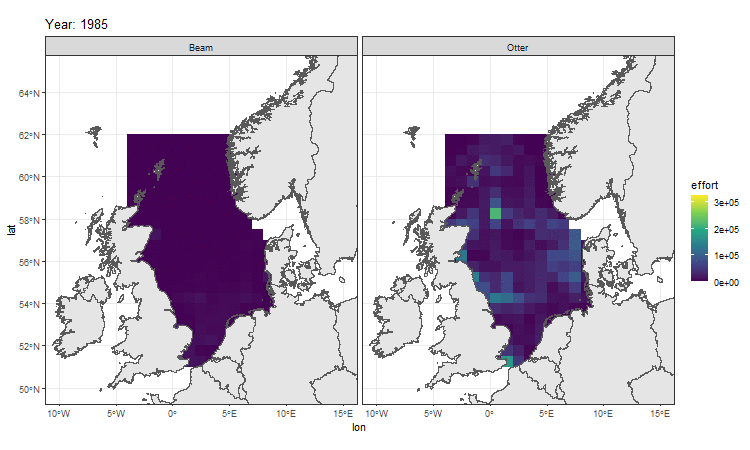

**source of data :** 
Couce, Engelhard, Schratzberger (2019). Reconstruction of North Sea trawling effort 1985-2015. Cefas, UK. V2. doi: https://doi.org/10.14466/CefasDataHub.61

**link to download data :** 
https://www.cefas.co.uk/data-and-publications/dois/reconstruction-of-north-sea-trawling-effort-1985-2015/

 

**Beam Trawl and Otter trawl in the North Sea through years from 1985 to 2015 :**

